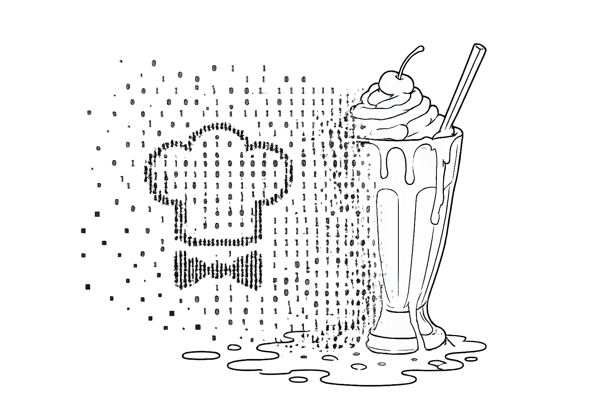

<p align="center">
  
</p>

<h1 align="center">ChefLM</h1>
<p align="center"><em>A ~7M parameter LLM that talks like a milkshake-obsessed chef.</em></p>

<p align="center">
  <a href="https://huggingface.co/BT-Rajan/chef-9m"></a>&nbsp;
  <a href="https://github.com/BT-Rajan/chefLM/blob/main/LICENSE"></a>&nbsp;
  <a href="https://github.com/BT-Rajan/chefLM/actions/workflows/ci.yml"></a>
  <br/>
  <a href="https://colab.research.google.com/github/BT-Rajan/chefLM/blob/main/train_chef.ipynb"></a>&nbsp;
  <a href="https://colab.research.google.com/github/BT-Rajan/chefLM/blob/main/use_chef.ipynb"></a>
  <br/><br/>
  <a href="https://bt-rajan.github.io/chef-rajan/"></a>
</p>

---

> **This project exists to show that training your own language model is not magic.**
> No PhD required. No massive GPU cluster. One Colab notebook, a few minutes, and you have a working LLM that you built from scratch — data generation, tokenizer, model architecture, training loop, and inference. If you can run a notebook, you can train a language model.
>
> It won't produce a billion-parameter model that writes essays. But it will show you exactly how every piece works — from raw text to trained weights to generated output — so the big models stop feeling like black boxes.

---

```
You> hi
Chef> vanakkam! welcome to milkshake mystery. how can i help you today?

You> what is your favorite milkshake flavor
Chef> chocolate. it always wins.

You> how do you make a milkshake
Chef> blend milk and ice cream together until smooth.

You> is a milkshake healthy
Chef> not really, it's a sweet treat, best in moderation.

You> what toppings go well on a milkshake
Chef> whipped cream, a cherry, or chocolate syrup.

You> what is the difference between a milkshake and a smoothie
Chef> a milkshake uses ice cream, a smoothie usually doesn't.

You> when were milkshakes invented
Chef> they became popular in the early 1900s in the united states.

You> bye
Chef> stay safe, have a great day & bye!
```

---

## What is ChefLM?

ChefLM is a tiny language model that pretends to be a chef named Chef, obsessed with milkshakes. It speaks in short, lowercase sentences about flavors, ingredients, toppings, and milkshake-making technique. It doesn't try to be a general-purpose assistant — just a focused, small character model.

It's trained from scratch on a 1205-sample hand-written dataset (110 -> 350 -> 1000 -> 1050 -> 1059 -> 1205, English + Arabic) across 14 topics, runs on a CPU in a few minutes, and produces a model small enough to run in a browser.

---

## Architecture

| | |
|---|---|
| **Parameters** | 7.3M |
| **Layers** | 6 |
| **Hidden dim** | 384 |
| **Heads** | 6 |
| **FFN** | 768 (ReLU) |
| **Vocab** | 512 (BPE) |
| **Max sequence** | 128 tokens |
| **Norm** | LayerNorm |
| **Position** | Learned embeddings |
| **LM head** | Weight-tied with embeddings |

Vanilla transformer. No GQA, no RoPE, no SwiGLU, no early exit. As simple as it gets.

---

## Personality

Chef:
- Speaks in short, lowercase sentences
- Talks about milkshake flavors, ingredients, technique, and trivia
- Has opinions about desserts and doesn't hide them
- Is friendly, direct, and a little repetitive
- Thinks about milkshakes a lot

**14 topics:** flavor, ingredients, howto, topping, temperature, ordering, health, comparison, opinion, funfact, recipe, nutrition, banter, redirect.

---

## Quick Start

### Try in Browser (no install needed)

[](https://bt-rajan.github.io/chef-rajan/)

Runs entirely in your browser via WebAssembly. Downloads a quantized ONNX model (~7.5 MB) and runs inference locally — no server, no API keys.

### Chat with Chef in Colab

[](https://colab.research.google.com/github/BT-Rajan/chefLM/blob/main/use_chef.ipynb)

Downloads the pre-trained model from HuggingFace and lets you chat. Just run all cells.
(Note: `BT-Rajan/chef-9m` is currently a placeholder — create and populate that HF repo before this notebook will work, or point `HF_REPO` at wherever you've published your own checkpoint.)

### Train your own

[](https://colab.research.google.com/github/BT-Rajan/chefLM/blob/main/train_chef.ipynb)

1. GPU is optional — the 1205-sample dataset trains fine on CPU (a bit slower than smaller runs, see Design Decisions); set runtime to **T4 GPU** if you want it faster
2. **Run all cells** — generates the dataset, trains tokenizer, trains model, tests it
3. Upload to HuggingFace or download locally

### Chat locally

```bash
pip install torch tokenizers
python -m chef chat
```

```
You> what size milkshake should i order
Chef> a medium is usually enough for one person.

You> is a frappe the same as a milkshake
Chef> not quite, a frappe usually has coffee blended with ice.
```

In interactive chat mode, the conversation grows and quickly runs into the 128-token limit, reducing quality.
You can also invoke chat with a single prompt, and exit after the response:

```bash
python -m chef chat --prompt "tell me a fun fact about milkshakes"
```


---

## Dataset

This project uses a hand-written 1205-sample experiment dataset about milkshakes (110 -> 350
-> 1000 -> 1050 -> 1059 -> 1205; 1059 English + 146 Arabic)
(`chef/milkshake_data.py`) — a starting point for learning the training pipeline, not a
production dataset.

| | |
|---|---|
| Samples | 1205: 1059 English + 146 Arabic (~1145 train / ~60 eval) |
| Format | `{"input": "...", "output": "...", "category": "...", "lang": "en"\|"ar"}` |
| Categories | 14 (flavor, ingredients, howto, recipe, topping, temperature, ordering, health, nutrition, comparison, opinion, funfact, redirect, banter) |
| Generation | Hand-written, static |

```bash
python -m chef prepare      # writes data/train.jsonl, data/eval.jsonl, data/tokenizer.json
```

With only 110 samples, the model mostly memorized rather than generalized — it reproduced
near-exact answers for prompts close to training examples, and could blend two answers together
on novel phrasing. Phase 1 scaled to 350 samples (more paraphrase variety, heavier `redirect`
coverage). Phase 2 scaled further to 1000 samples and added two new categories: `recipe` (specific
step-by-step answers per flavor) and `nutrition` (calorie/sugar facts, distinct from the more
general `health` category). Phase 3 added a `banter` category (50 samples: greetings, small talk,
chef personality, some answers that toss a question back) — this is NOT multi-turn memory, the
model still has no context across messages; it's personality depth within a single exchange,
aimed at making individual replies feel warmer rather than purely transactional.

**Known limitations at this scale**, tested directly rather than assumed:
- On a random sample of 25 exact training questions across all 14 categories, the model
  reproduced the exact trained answer 23/25 times (92%) — recall is strong for questions matching
  (or close to) trained phrasing, including the new `banter` category.
- **Recipe questions are sensitive to exact phrasing.** Each flavor's recipe was only trained
  with one of several possible question templates (e.g. "give me a recipe for X" vs "how do i
  make X from scratch"), so asking about a specific flavor with a phrasing that wasn't used for
  that particular flavor can retrieve a different flavor's recipe instead. Using the exact
  trained phrasing for a given flavor reliably gets the right recipe.
- **The `health` category is unusually dense** (66 samples, all structurally similar "is X
  healthy/safe/okay" phrasing) and can occasionally show answer-blending even on exact-match
  questions in this and other densely-packed categories (`comparison`, `opinion`). This didn't
  resolve with additional training steps — it looks like a genuine capacity/interference tradeoff
  at ~7.4M params with 14 categories this densely packed, not an undertraining issue.

Further scaling (3,000+ samples) has diminishing returns at this model size — see the
conversation history for a fuller breakdown of alternative strategies (fine-tuning a pretrained
model, fixing specific known gaps, increasing model capacity, or a retrieval-based approach) if
you want to keep improving response quality from here. See "Design Decisions" below for why
hand-written data was chosen over templates in the first place, a tradeoff that gets more
expensive to maintain by hand as the dataset grows.

---

## Grammar Check

Replies get cleaned up before you see them, but the two surfaces do this differently:

**Python CLI** (`chef/inference.py` → `chef/grammar.py`) — real grammar
correction via [LanguageTool](https://languagetool.org/) (`language_tool_python`),
catching things like subject-verb agreement, not just spacing/capitalization.
LanguageTool is Java-based and downloads a ~200MB package the first time it runs
on a machine — after that first run it's cached and adds negligible latency.

```bash
python -m chef chat                       # grammar check on by default
python -m chef chat --no-grammar-check    # skip it (faster, no Java/network needed)
```

**Browser demo** (`docs/index.html`) — a real grammar library can't run in a static
WASM page, so it gets a lightweight client-side cleanup instead: capitalization,
spacing, and terminal punctuation only. It won't catch grammar mistakes like
subject-verb agreement — that's a genuine gap between the two surfaces, not a bug.

**Optional persona layer** (`chef/persona.py`) — a small, deterministic
text-rewriting pass applied after grammar-checking. Off by default; it never
changes the model's weights or its computed output, just adds light
Indian-English conversational flavor (tag words, occasional openers) to the
already-generated reply.

```bash
python -m chef chat --persona indian                        # on, default intensity
python -m chef chat --persona indian --persona-intensity 0.6 # tag more sentences
```

### Bilingual (English/Arabic)

Every reply can be forced into English or Arabic regardless of what script the
prompt itself is written in. This works by training on a `<|lang_en|>`/`<|lang_ar|>`
tag placed right after the assistant preamble (see `data_utils.format_sample`) —
the model learns to always continue that tag with text in the matching
language, so the target language is an explicit signal rather than something
it has to infer from the input. The Arabic training samples
(`chef/milkshake_data.py`, `lang="ar"`) are natural Modern Standard Arabic
written directly for this persona — not machine-translated or transliterated
from the English samples — covering the same 14 categories as a smaller
Phase-1-sized starting set (146 samples), the same way English itself started
smaller and grew.

```bash
python -m chef chat --lang en   # default
python -m chef chat --lang ar
```

**Browser demo**: a language toggle (`EN`/`AR`) in the header does the same
thing — flips the sample pills, topics hint, and placeholder text to Arabic,
and appends the matching `<|lang_xx|>` tag to every prompt sent to the model.
Message bubbles use `dir="auto"` so Arabic renders right-to-left correctly
regardless of the toggle state.

---

## Project Structure

```
chef/
├── config.py               Hyperparameters (model + training)
├── model.py                Vanilla transformer
├── dataset.py              Data loading + batching
├── train.py                Training loop (cosine LR, AMP)
├── data_utils.py            Shared sample-formatting helpers
├── milkshake_data.py        Milkshake experiment dataset (1205 samples: 1059 English + 146 Arabic)
├── grammar.py               LanguageTool grammar check (CLI only, bilingual)
├── prepare_data.py         Data prep + tokenizer training
└── inference.py            Chat interface

tools/
├── make_colab.py           Generates Colab notebooks
├── export_onnx.py          Export model to ONNX (quantized uint8)
└── model_card.md           HuggingFace model README

docs/
├── index.html              Browser demo (ONNX + WASM)
├── download.sh             Download model.onnx + tokenizer from HF
├── model.onnx              Quantized uint8 (~7.5 MB)
├── tokenizer.json          BPE tokenizer
└── chef.png          Logo (transparent)
```

---

## Design Decisions

**Why no system prompt?** Every training sample had the same one. A 7M model can't conditionally follow instructions — the personality is baked into the weights. Removing it saves tokens per inference.

**Why single-turn only?** Multi-turn degraded quickly due to the 128-token context window. Single-turn is reliable.

**Why vanilla transformer?** GQA, SwiGLU, RoPE, and early exit add complexity that doesn't help at 7M params. Standard attention + ReLU FFN + LayerNorm produces the same quality with simpler code.

**Why hand-written data instead of synthetic templates?** The original fish-persona dataset used template composition (60 topics, randomized components) to generate 60K samples. This fork replaced that with hand-written milkshake samples (110 initially, expanded to 350 in Phase 1) as a smaller, easier-to-understand starting point for learning the pipeline — see [Dataset](#dataset) above for the honest tradeoffs that come with it.

---

## License

MIT
